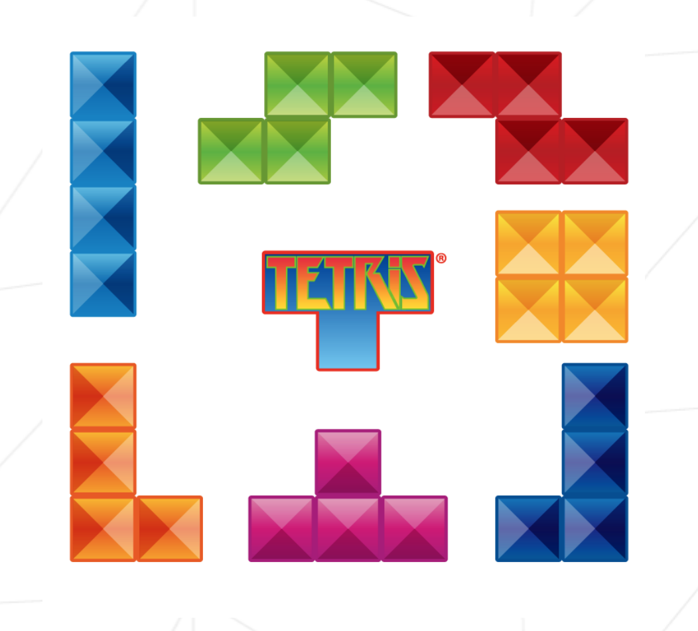

# fillit
This project helps to improve skills in algorithms: searching the optimal solution among a huge set of possibilities, in a respectable timing.
In this project have found a way to assemble a given Tetriminos set altogether in the smallest possible square.
A Tetriminos is a 4-blocks geometric figure you probably already heard of, thanks to the popular game Tetris.

